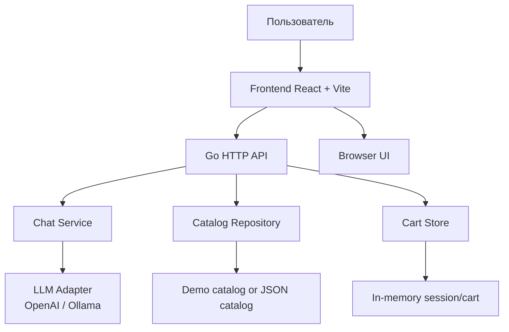

# CareTech — AI assistant for electrical catalog

CareTech — это веб-приложение для поиска и подбора электротехнических товаров по каталогу EKT с интеграцией ИИ-ассистента. Проект помогает пользователю быстро найти товар, посмотреть характеристики, проверить наличие и подобрать подходящую замену, не уходя из интерфейса.

## Главный функционал

- Поиск товаров по названию, бренду, SKU, артикулу и ID
- Просмотр актуальной цены и наличия по складам
- Показ характеристик товара: ток, напряжение, тип монтажа, номинал и др.
- Поиск альтернативных товаров при отсутствии нужной позиции
- Чат-ассистент, который понимает запросы пользователя и подсказывает товар или замену
- Подтверждение добавления в корзину до фиксации заказа
- Корзина по session_id с отдельной логикой подтверждения
- Поддержка локального Ollama и внешних OpenAI-compatible сервисов
- Поддержка демо-данных, если JSON-каталог не подключён

## Что реализовано в продукте

- Frontend на React + Vite
- Backend на Go
- Контроллеры API для каталога, чата и корзины
- Минимальная in-memory система хранения корзины и сессий
- Поддержка корзины через pending-confirm workflow
- Гибкая интеграция с LLM через переменные окружения

## Стек технологий

- Go 1.22
- React 19
- Vite 8
- JavaScript / JSX
- HTML / CSS
- Docker + Docker Compose
- PostgreSQL-ready integration (optional)
- OpenAI-compatible API / Ollama
- Git + GitHub

## Блок-схема структуры проекта



## Структура репозитория

```text
careTech/
+- cmd/
¦  L- server/
¦     L- main.go
+- internal/
¦  +- cart/
¦  +- catalog/
¦  +- chat/
¦  +- db/
¦  +- httpapi/
¦  L- llm/
+- src/
¦  +- App.jsx
¦  +- App.css
¦  +- main.jsx
¦  L- ...
+- public/
+- data/
+- .env.example
+- .gitignore
+- docker-compose.yml
+- Dockerfile.backend
+- Dockerfile.frontend
+- go.mod
+- package.json
+- vite.config.js
+- README.md
L- index.html
```

## Как запустить проект локально

### 1. Клонирование

```bash
git clone https://github.com/BAITC-Hacks/hack-a7cf2003-caretech.git
cd careTech
```

### 2. Установка зависимостей фронтенда

```bash
npm install
```

### 3. Запуск backend

Сначала создайте файл `.env` на основе `.env.example` и задайте переменные:

```env
LLM_API_KEY=your_api_key_here
LLM_BASE_URL=https://api.openai.com/v1/chat/completions
LLM_MODEL=gpt-4o-mini
DATABASE_URL=
EKT_PRODUCTS_FILES=
```

Для Ollama используйте:

```env
LLM_API_KEY=ollama
LLM_BASE_URL=http://localhost:11434/v1/chat/completions
LLM_MODEL=qwen2.5:7b
```

Запуск Go backend:

```bash
go run ./cmd/server
```

Backend будет доступен по адресу:

```text
http://localhost:8080/health
```

### 4. Запуск frontend

```bash
npm run dev -- --host 0.0.0.0
```

Frontend будет доступен по адресу:

```text
http://localhost:5173/
```

### 5. Проверка API

Health-check:

```bash
curl http://localhost:8080/health
```

Поиск товара:

```bash
curl "http://localhost:8080/api/products?q=ABB"
```

Чат запрос:

```bash
curl -X POST http://localhost:8080/api/chat \
  -H "Content-Type: application/json" \
  -d '{"session_id":"demo-1","message":"Есть ABB-S201-C16?"}'
```

## Запуск через Docker

```bash
docker compose up --build
```

После этого:

- frontend: http://localhost:5173
- backend: http://localhost:8080

## Примечания

- В продакшене нужно вынести хранение сессий и корзины в Redis/PostgreSQL.
- Данные каталога можно подключать из JSON-выврузок EKT через переменную `EKT_PRODUCTS_FILES`.
- Не храните API-ключи в репозитории. Используйте локальный `.env` и добавьте его в `.gitignore`.

## Команда проекта

- Backend: Go + HTTP API
- Frontend: React + Vite
- AI: OpenAI-compatible API / Ollama
- Product logic: catalog search and alternatives
- Cart logic: confirmed add-to-cart flow

## Автор

CareTech / HackAlem style prototype for electric equipment catalog assistant.
